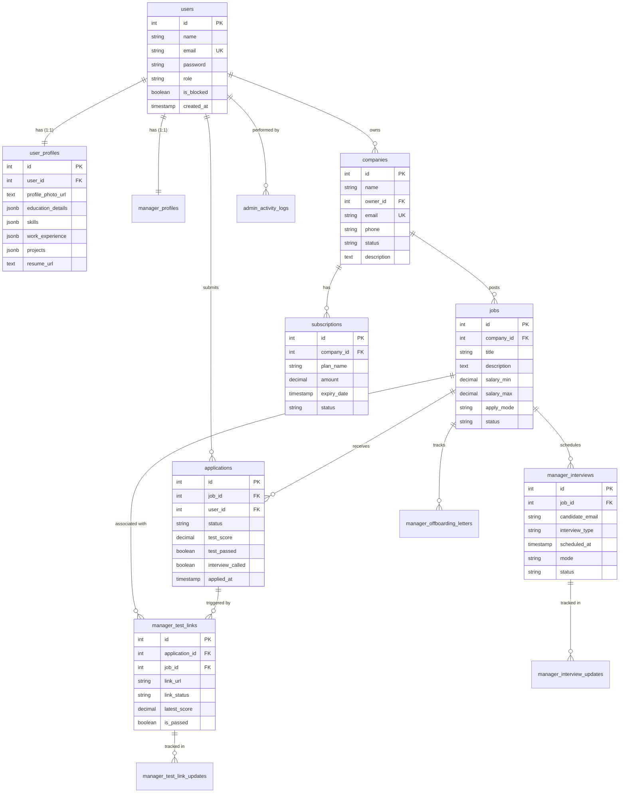

# HireHub Database ER Diagram

This document provides a visual representation of the PostgreSQL database schema for the HireHub project, based on the `setup.sql` definition.

## 📊 Entity-Relationship Diagram

## 🔑 Key Relationships

1.  **Identity Management**: The `users` table is the central hub. It links to `user_profiles` (for candidates) and `manager_profiles` (for recruiters) in one-to-one relationships.
2.  **Corporate Structure**: `users` own `companies`, which in turn post `jobs`.
3.  **Recruitment Funnel**:
    *   Candidates (`users`) submit `applications` for `jobs`.
    *   Applications can trigger `manager_test_links` for assessments.
    *   Successful candidates move to `manager_interviews`.
4.  **Audit & Logs**: `admin_activity_logs` track actions performed by Admin users.
5.  **Billing**: `subscriptions` track the payment status and plan tiers for each company.

## 🛠️ Data Types Note
*   **JSONB**: Used extensively in `user_profiles` for flexible data like skills, experience, and accomplishments.
*   **SERIAL**: Primary keys are auto-incrementing integers.
*   **TIMESTAMP**: Used for tracking creation and update events across all tables.
